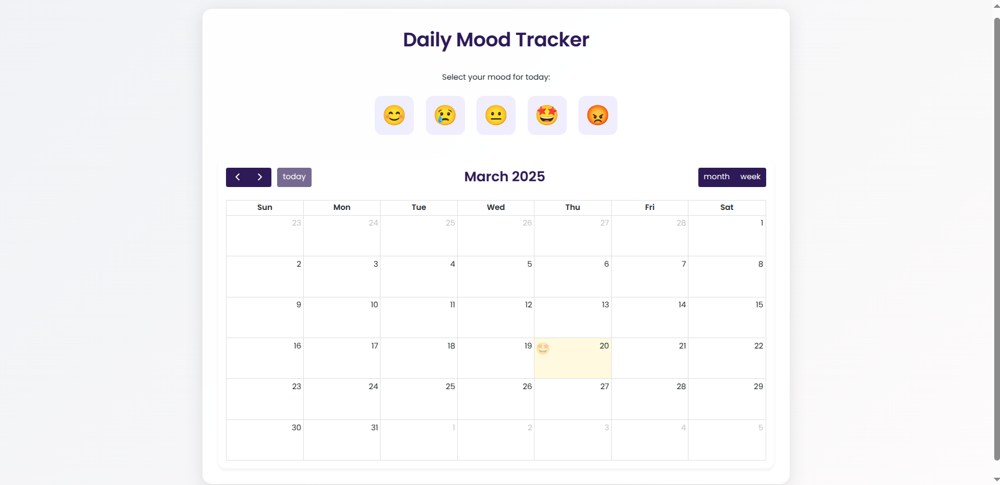

# 🌤️ Mood Tracker

A beautiful and responsive web application for tracking daily moods with calendar visualization, built with HTML/CSS/JavaScript and FullCalendar.js.

[](https://deepakdotcom.github.io/MoodTracker/)

 <!-- Add your screenshot here -->

## Features

- **Daily Mood Logging**  
  🎭 Select from 5 emoji moods (😊 😢 😐 🤩 😡)  
  ⚠️ One entry per day restriction

- **Calendar Visualization**  
  📅 FullCalendar.js integration  
  🌈 Moods displayed directly on calendar dates  
  🔄 Month/Week view switching

- **Data Persistence**  
  💾 LocalStorage for mood history  
  🔄 Automatic data sync

- **Modern UI**  
  📱 Fully responsive design  
  🚀 Smooth animations

- **Bonus Features**  
  📆 Date navigation controls  
  🔍 Mood history at a glance  

## Installation

1. Clone repository:
   ```bash
   git clone https://github.com/yourusername/mood-tracker.git